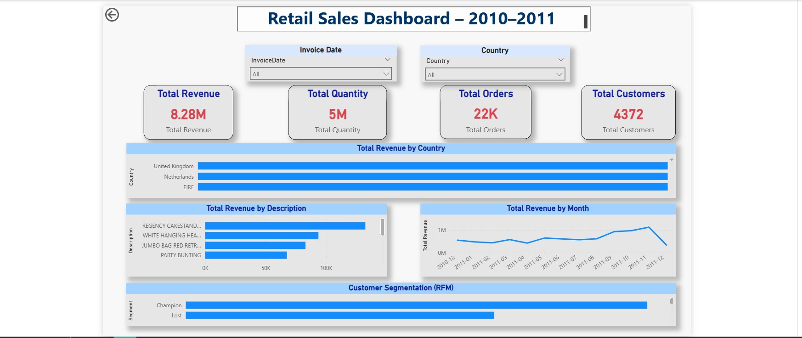
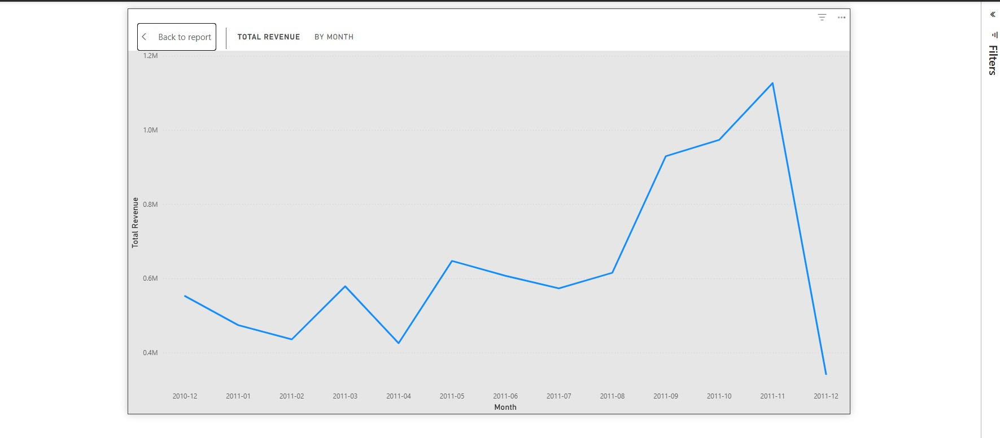
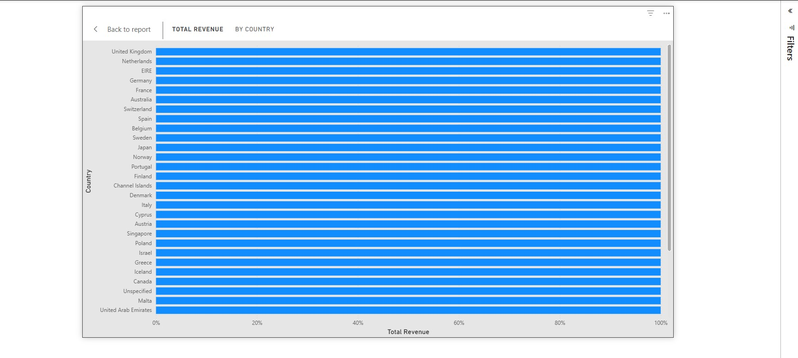
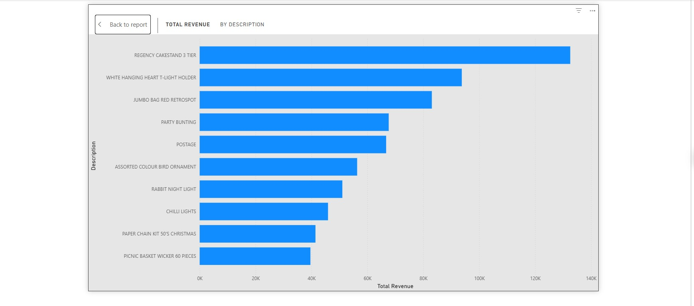
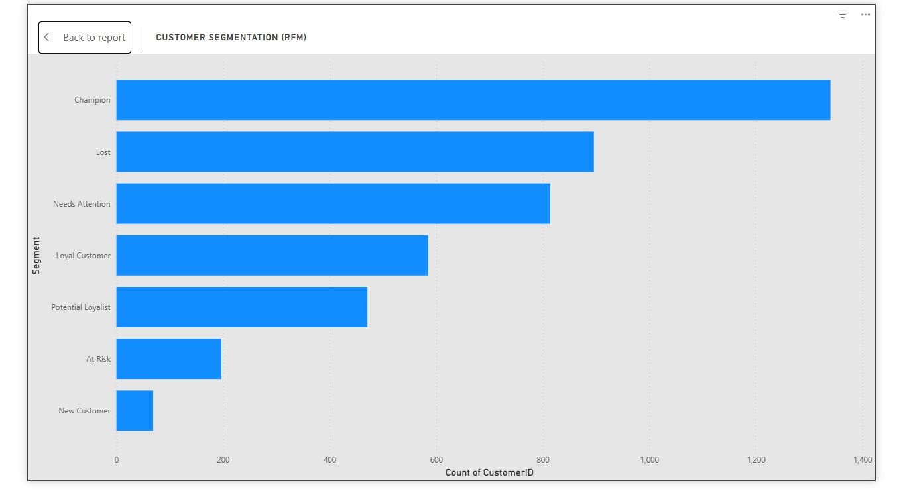

# 🛒 Retail Customer Segmentation Project

## 📌 Project Overview
This project focuses on analyzing retail sales data to uncover business insights and customer behavior.  
It includes data cleaning, exploratory data analysis (EDA), and RFM (Recency, Frequency, Monetary) customer segmentation using Python and Power BI.

---

## 🧰 Tools & Technologies
- Python (Pandas, NumPy, Matplotlib, Seaborn)
- Power BI
- Excel
- SQL (conceptual)
- GitHub

---

## 📂 Project Structure
Retail-Customer-Segmentation-Project/
│
├── data/
│ ├── retail_sales.xlsx
│ ├── clean_sales.csv
│ └── rfm_output.csv
│
├── scripts/
│ ├── clean_sales.py
│ └── eda_analysis.py
│
├── powerbi/
│ └── retail_dashboard.pbix
│
├── screenshots/
│ ├── retail_sales_dashboard.jpg
│ ├── revenue_by_month.jpg
│ ├── revenue_by_country.jpg
│ ├── revenue_by_product.jpg
│ └── rfm_segmentation.jpg
│
└── README.md

---

## 🧹 Data Cleaning
- Removed missing and invalid records
- Handled duplicate transactions
- Converted invoice dates to datetime format
- Standardized column names

Script used:
- `scripts/clean_sales.py`

---

## 🔍 Exploratory Data Analysis (EDA)
EDA was performed to analyze:
- Monthly revenue trends
- Country-wise sales performance
- Top-selling products
- Customer purchasing behavior

Script used:
- `scripts/eda_analysis.py`

---

## 📊 Power BI Dashboard

### 🔹 Dashboard Overview

---

### 📈 Total Revenue by Month

---

### 🌍 Total Revenue by Country

---

### 🛍 Total Revenue by Product

---

## 🧮 Customer Segmentation (RFM)

---

## ✅ Key Insights
- Identified high-value (Champion) customers
- Detected customers at risk of churn
- United Kingdom contributed the highest revenue
- Clear seasonal sales patterns observed

---

## 👨‍💻 Author
**Ashok Suravarapu**  
BCA Graduate | Data Analytics Enthusiast

